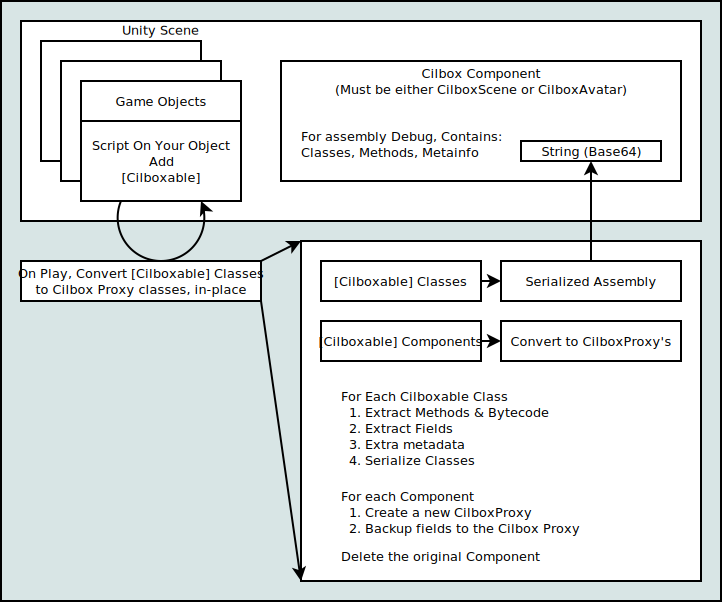

# Cilbox

### This is incomplete, and portions will change. Please do not use this for production systems without significant testing.

`Cilbox` is a CIL emulator, geared for Unity. It allows the execution of arbitrary CIL code in a relatively sandboxed manner. In that whatever access is granted to types/methods, the script running within the sandbox can access.  This is NOT ia JITter.  This does not use fancy language constructs, and works (actually works best) in IL2CPP.

The performance is surprisingly high for something that is written in C# and not JITting.

Performance has been tested on Synergiance's 6502 emulator.  It is able to just barely hit `2MHz` in-system. While running the 6502, verses about `240MHz` native, the rate that this system executes CIL insturctions is about `168 MHz`, when targeting IL2CPP in Unity 6.1.2f1 running on a 9950X3D.

## Security Disclaimer

I am not a security researcher. I cannot make promises about the security of the core portion of the engine. I also cannot make claims to the fitness or suitability for any purpose.  There are likely bugs, so if you have one, I strongly encourage submitting a pull request.

## Design

There is a `Cilbox` object that gets placed in the scene at runtime. This box
is responsible for loading and manging the various `CilboxProxy` classes that
are converted.  There can be multiple cilboxes one per scene loaded in a world.
Ideally the scene could have a `CilboxScene` and an avatar could also have a `CilboxAvatar`

### The general approach
1. You mark your class as `[Cilboxable]`
2. On build, any components with a `[Cilboxable]` script are serialized, and replaced with a `CilboxProxy` which has a public String containing the serialized data for all of its properties.
3. All classes that are `[Cilboxable]` are reflected and all fields information and method bytecode is extracted and saved off as a serialized ball of goo.
4. All `[Cilbox`ed classes are loaded out of the ball of goo into a dictionary of classes where the bytecode is kept as byte arrays, and static members are configured with their appropriate types.
5. When running, each gameobject with a `CilboxProxy` will wake up, and load into a series of `object`s the data that was part of the original class.
6. Whenever `Start` or `Update` is called, the `CilboxProxy` will ask `Cilbox` to emulate the bytecode associated with that method.
7. The bytecode emulator can make all needed decisions about proper sandboxing, infinte loop termination, etc. But for the most part, my intent is to just disable any code that's doing something that could be usnafeish.

### Cilbox has
 * `CilboxableAttribute` So you can add `[Cilboxable]` to your class as an attribute that will tell Cilbox to emulate it.
 * `CilboxProxy` - The MonoBehaviour that replaces your script.
 * `Cilbox` - Internal, abstract class that contains a given asset's "Box" that its scripts live in.
 * `CilboxAvatar` / `CilboxScene` - Concrete classes from `Cilbox` that is added to each Avatar or Scene, respectively.

### Cilbox internally uses
 * `CilboxMethod` - for holding information about classes that are being overridden.
 * `CilboxClass` - for holding information about classes that are being overridden.
 * `StackElement` - a generic "object" like thing that can be written into/altered/etc, without needing to box/unbox/etc.  This holds parameters, locals, and the stack.
 * These Stack Elements can be: `Boolean`, `Sbyte`, `Byte`, `Short`, `Ushort`, `Int`, `Uint`, `Long`, `Ulong`, `Float`, `Double`, `Object`, `Address`, and `Reference`
 * If the StackElement is an `Object`, boxing will need to happen when it gets used.
 * If the StackElement is an `Array`, then it is actually a reference, where .o contains the link to the `Array` and .i contains the reference to the element.

### Security

The general idea is that at load, the Cilbox will load all classes, metadata, and methods.  Then any references that script has to the surrounding system are patched in, but only if the specific class/method is allowed.

In general, the process for deciding if a feature is allowed is:
1. Is the CLASS pertaining to this meta (callee, parameter, field, etc.) associated with this meta/call allowed by seeing if it is on the whitelist by calling `CheckTypeAllowed( String sType )`
2. If the CLASS is on the whitelist, then it will call `CheckMethodAllowed()`.  If CheckMethodAllowed says it's OK, then the reference can be made.

For additional information:
 * For all security-related notes surrounding the load decisions, please see [CilboxUsage.cs](Packages/com.cnlohr.cilbox/CilboxUsage.cs). 
 * For avatar/scene decisions regarding what can or cannot be loaded, please see the specific [CilboxAvatar.cs](Packages/com.cnlohr.cilbox/CilboxAvatar.cs) / [CilboxScene.cs](Packages/com.cnlohr.cilbox/CilboxScene.cs). 

### Resource accounting

While a cilbox is executing, every 64 cycles it reports back to the owning box that it is using CPU time.  If the amount of time spent executing that cilbox per frame exceeds `timeoutLengthTicks` ticks, then, the script will be killed at the next 64-cycle checkin.

Execution time encompasses all time that is spent while there is a cilbox execution context.  For example, if your cilbox calls a Unity function, while it is within the unity function, it will be accounted against your script.  If your script is executing, and another method is called from a thread concurrently, then that time is only single-accounted.

By default, `timeoutLengthTicks` is 500ms.  For Avatars, 5ms.

If execution within a box is exceeded, the box is disabled.  The box can be re-enabled by setting a flag on the box, to re-enable it, but in general, it should be expected to stay off, unless the asset is unloaded.

### Things you can't do (At least not today)
 * You cannot arbitrarily add an externally accessable method to your script. For instance, you cannot add your script to Unity UI and select a function that is not available in the `CilboxProxy`.  So, only input functions like `Start()` `Awake()` `FixedUpdate()` `Update()` etc...
 * It is unlikely any form of reflection would be possible, because, it would be extremely difficult to secure.
 * It will be tricky to allow compound types for security reasons.
 * You can't currently reference fields of objects outside Cilbox, but you can access properties that have getters/setters.  This may be considered in the future.

## Cleanup
 * Clean up the `GetConstructors` code to use `GetConstructor` but we need access to the modifiers.
 * Improve the definitions for serializing the list of data for Methods, Fields, and Strings in the `assemblyRoot["metadata"]`. Maybe encapsulate again.  
 * Make it so we can initialize before Start.  Waiting til Start is very depressing.
 * Try to make sense of when we should be init/start/awakening'ing.
 * Figure out where "The referenced script (Unknown) on this Behaviour is missing!" is coming from.

